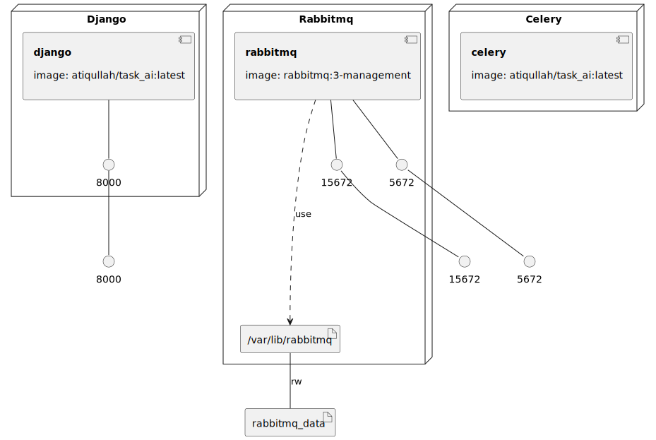

# Task AI - Server

Task AI is an innovative, AI-powered task manager designed to streamline task management and improve productivity. This repository contains the backend server side part of this project. The server is writeen in Django python.

RabbitMQ is used as the Celery backend, when Django gets a prompt request it sends it off to OpenAI to a hardcoded Assistant ID and Thread ID. OpenAI returns a Run ID. The Celery worker makes requests to the OpenAI API to check the status of the run and prints the output out on the terminal when a response is received.

## Getting Started

### Docker Compose

To get started right away there is a `/docker/docker-compose.yml` file that will start a `rabbitmq` container as well as containers for Django and the Celery worker.

### Makefile

The included Makefile at the root of the repo contains several useful tasks to run during development and that are used in the Github Actions to check things before they are added to the main branch.

---

### Task AI Development Stages

#### Stage 1: Enhanced User Input
  - **Expansion:** Incorporate voice and image inputs, converting them to text using AI technologies.

#### Stage 2: Advanced Text Interpretation
  - **Improvement:** Use NLP techniques for deeper understanding, identifying nuances like emotions and urgency.

#### Stage 3: Dynamic Categorization
  - **Algorithm Enhancement:** Employ machine learning for context-aware, dynamic categorization.

#### Stage 4: Task Management Integration
  - **Functionality:** Convert categorized inputs into tasks with automated features and third-party integrations.

#### Stage 5: Feedback Loop and AI Learning
  - **User Interaction:** Implement feedback mechanisms to refine AI accuracy and relevance over time.
### Infrastructure model

- [django component model](.infragenie/django_component_model.svg)

---
